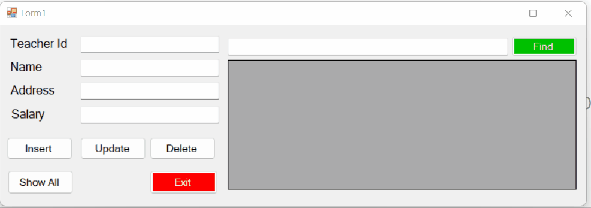

# 🖥️ CRUD Operation in WPF (.NET)

This is a basic **CRUD (Create, Read, Update, Delete)** application built using **WPF (.NET Framework)** for managing teacher records. The application uses a clean and simple UI to demonstrate basic database operations such as:

- Inserting new teacher data
- Updating existing records
- Deleting a record
- Searching a teacher by ID
- Displaying all records

---

## 📸 Screenshot

> *Main WPF UI for teacher management with basic CRUD functionality.*

---

## 🎞️ Live Demo



---

## 🧰 Tech Stack

- **WPF (.NET Framework / .NET Core)**
- **C#**
- **XAML**
- **SQL Server / LocalDB**
- **ADO.NET** (for database interaction)

---

## 🧑‍💻 Features

- Insert new teacher records with `Teacher ID`, `Name`, `Address`, and `Salary`
- Search a teacher by ID
- Update existing teacher data
- Delete teacher record
- View all records in a grid
- Exit button for closing the app

---

## 🚀 Getting Started

### 1. Clone the Repository

```bash
git clone https://github.com/your-username/WPF-CRUD-Teacher.git
cd WPF-CRUD-Teacher
